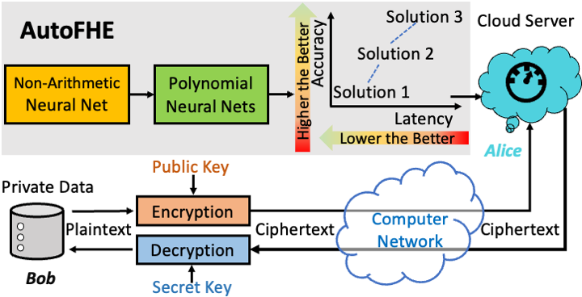
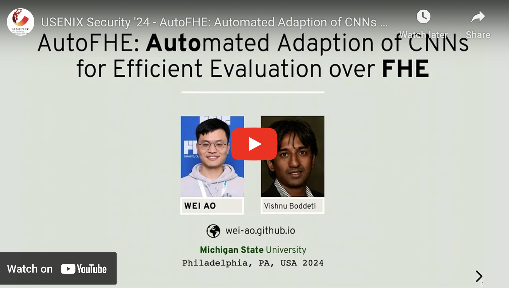
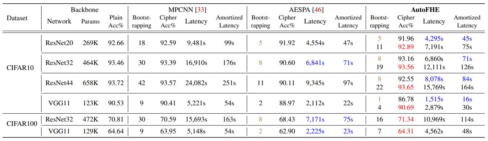

# AutoFHE: Automated Adaption of CNNs for Efficient Evaluation over FHE

Official implementation for AutoFHE: Automated Adaption of CNNs for Efficient Evaluation over FHE. The paper is presented at [the 33rd USENIX Security Symposium](https://www.usenix.org/conference/usenixsecurity24/presentation/ao), 2024.



<details>
<summary><i>Optimize the end-to-end polynomial neural architecture rather than the polynomial activation function.</i></summary> 
Secure inference of deep convolutional neural networks (CNNs) under RNS-CKKS involves polynomial approximation of unsupported non-linear activation functions. However, existing approaches have three main limitations: 1) <i>Inflexibility</i>: The polynomial approximation and associated homomorphic evaluation architecture are customized manually for each CNN architecture and do not generalize to other networks. 2) <i>Suboptimal Approximation</i>: Each activation function is approximated instead of the function represented by the CNN. 3) <i>Restricted Design</i>: Either high-degree or low-degree polynomial approximations are used. The former retains high accuracy but slows down inference due to bootstrapping operations, while the latter accelerates ciphertext inference but compromises accuracy. To address these limitations, we present AutoFHE, which automatically adapts standard CNNs for secure inference under RNS-CKKS. The key idea is to adopt layerwise mixed-degree polynomial activation functions, which are optimized jointly with the homomorphic evaluation architecture in terms of the placement of bootstrapping operations. The problem is modeled within a multi-objective optimization framework to maximize accuracy and minimize the number of bootstrapping operations. AutoFHE can be applied flexibly on any CNN architecture, and it provides diverse solutions that span the trade-off between accuracy and latency. Experimental evaluation over RNS-CKKS encrypted CIFAR datasets shows that AutoFHE accelerates secure inference by $1.32\times$ to $1.8\times$ compared to methods employing high-degree polynomials. It also improves accuracy by up to 2.56% compared to methods using low-degree polynomials. Lastly, AutoFHE accelerates inference and improves accuracy by $103\times$ and 3.46%, respectively, compared to CNNs under TFHE.
</details>

```angular2html
@inproceedings{ao2024autofhe,
  title={{AutoFHE}: Automated adaption of {CNNs} for efficient evaluation over {FHE}},
  author={Ao, Wei and Boddeti, Vishnu Naresh},
  booktitle = {33rd USENIX Security Symposium (USENIX Security 24)},
  year = {2024},
  isbn = {978-1-939133-44-1},
  address = {Philadelphia, PA}, 
  pages = {2173--2190},
  url = {https://www.usenix.org/conference/usenixsecurity24/presentation/ao},
  publisher = {USENIX Association},
  month = aug
}
```
### Presentation at USENIX Security Symposium 2024

[](https://youtu.be/LuRnSJ7i3j8?feature=shared "[YouTube] Presentation at USENIX Security Symposium 2024")

### Talk at FHE.org Toronto 2024

[](https://www.youtube.com/watch?v=5jzfeUlMPyM&list=PLnbmMskCVh1fZy00EZQnFSezctvwYmlRM&index=1 "[YouTube] AutoFHE Talk at FHE.org Toronto 2024")

## Comparison Experiments (Quick Usage)

We benchmark AutoFHE and two baselines (MPCNN and AESPA) on the encrypted CIFAR dataset under RNS-CKKS.  You can simply compare your new methods with our results without re-running experiments in our paper. Please benchmark your method on the same environment to ensure a fair comparison between different methods. 

- **Hardware**: AWS r5.24large (96 CPUs and 768 GB RAM)
- **Library**: Microsoft SEAL 3.6 




## Run the Code

### 1. Prepare C++ Environment for RNS-CKKS Inference

The setup was successfully tested on AWS r5.24xlarge instance. 

> Install g++

```bash
sudo apt-get update
sudo apt-get install g++
sudo apt install make build-essential git
sudo apt install m4
sudo apt install cmake
```

> Install GMP (v6.2.1)

```bash
wget https://gmplib.org/download/gmp/gmp-6.2.1.tar.xz
tar xf gmp-6.2.1.tar.xz
cd gmp-6.2.1
./configure
make
make check
sudo make install
```

> Install NTL (v11.4.3)

```bash
wget https://libntl.org/ntl-11.4.3.tar.gz
tar xf ntl-11.4.3.tar.gz
cd ntl-11.4.3/src
./configure
make
make check
sudo make install
```

> Install OpenMP 

```bash
sudo apt-get update
sudo apt-get install libomp-dev
```

> Compile SEAL 

```bash
cd cnn_ckks/cpu-ckks/single-key/seal-modified-3.6.6
cmake -S . -B build
cmake --build build
sudo cmake --install build
```

> Compile CNN CKKS 

```bash
cd cnn_ckks
cmake -S . -B build
cd build
make
```

### 2. Download CIFAR datasets

[Dropbox](https://www.dropbox.com/scl/fo/fkk8iyawo13lnnjiigyar/AFM1pc-yYb2D7eYV8GTPPc4?rlkey=ypx5dailbgl3ndmc0aryxqv1m&st=1y56ma44&dl=0)

### 3. Evaluate CNNs under RNS-CKKS

MPCNN or AESPA: ./cnn [algorithm] [model] [dataset] [path_to_weight] [path_to_dataset] [path_to_output] [img_start_id] [img_end_id]

AutoFHE: ./cnn [algorithm] [model] [dataset] [path_to_weight] [path_to_dataset] [path_to_output] [boot] [img_start_id] [img_end_id]

```bash
# Evaluate MPCNN 
mkdir ckks_results
mkdir ckks_results/mpcnn
cd cnn_ckks/build
./cnn mpcnn vgg11 cifar10 ../../weights ../../datasets ../../ckks_results/mpcnn 0 96

# Evaluate AESPA 
mkdir ckks_results/aespa
cd cnn_ckks/build
./cnn aespa resnet32 cifar100 ../../weights ../../datasets ../../ckks_results/aespa 0 96

# Evaluate AutoFHE 
mkdir ckks_results/autofhe
mkdir ckks_results/autofhe/boot-11
cd cnn_ckks/build
./cnn autofhe resnet20 cifar10 ../../weights ../../datasets ../../ckks_results/autofhe 11 0 96
```

## Acknowledgement

The C++ implementation is built on top of https://github.com/snu-ccl/FHE-MP-CNN. 
